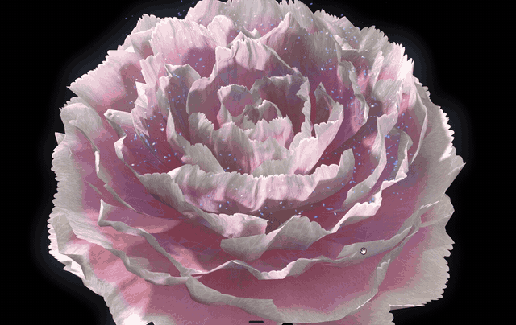

# Digital Peony

**Digital Peony** is an interactive procedural flower system and digital artwork that brings an organic peony into a distinctly digital visual language.

## [Live Demo](https://lewisorton.github.io/digital-peony/)

Built with Three.js, WebGPU, and TSL, it generates and animates a peony in real time.

Use a recent browser and device with WebGPU support.

<p align="center">
  
</p>

## Highlights

- Flower geometry, animation, and appearance generated entirely in code
- GPU-accelerated XPBD petal simulation with collision and direct interaction
- Custom procedural shaders and post-processing effects
- Entirely client-side, with no premade 3D models or texture assets

## Run Locally

```sh
npm install
npm run dev
```

Create a production build with:

```sh
npm run build
```

Production builds include Brotli (`.br`) and gzip (`.gz`) variants. `npm run preview` automatically serves the best format supported by the browser; public hosting should provide equivalent content negotiation.

## License

Digital Peony is released under the [Apache License 2.0](./LICENSE).

Copyright © 2026 [Lewis Orton](https://github.com/LewisOrton).
